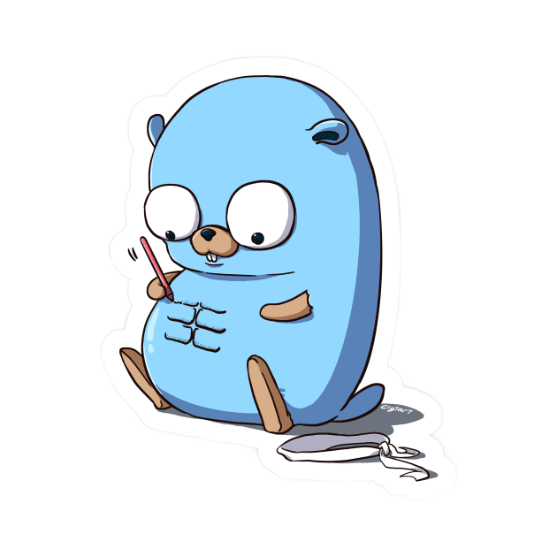

# Go Learning Journey! 🚀

Hey there! 👋 This is my cozy corner where I document my adventure in learning the Go programming language. 🐹 Join me on this exciting journey filled with code snippets, notes, and a treasure trove of resources!

I believe that knowledge grows best when shared, and I encourage you to contribute to this learning repository! If you've found a great resource, have a useful tip, or want to share your own learning insights, please feel free to open an issue or submit a pull request. Let's Go together! 🚀
